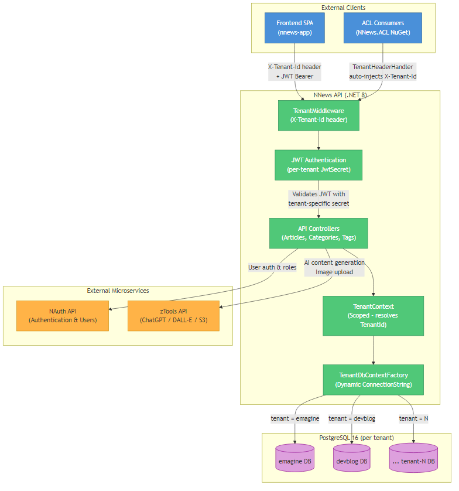

# NNews - Multi-Tenant CMS Microservice for News & Blogs


## Overview

**NNews** is a multi-tenant CMS (Content Management System) microservice for news and blogs with AI-powered content generation via ChatGPT and DALL-E 3. Built using **.NET 8**, **PostgreSQL 16**, and **Clean Architecture**, it provides a complete REST API for managing articles, categories, tags, and images — with full tenant isolation through separate databases and per-tenant JWT authentication.

NNews is part of the **Emagine ecosystem** and integrates with **NAuth** for authentication/user management and **zTools** for AI content generation, file uploads, and utility services.

---

## 🚀 Features

- 🏢 **Multi-Tenant Architecture** - Complete tenant isolation with separate databases and per-tenant JWT secrets
- 🤖 **AI Content Generation** - Create and update articles using ChatGPT integration
- 🖼️ **DALL-E 3 Image Generation** - AI-powered image creation for articles
- 📰 **Full CMS** - CRUD for articles, categories (hierarchical), and tags (with merge support)
- 🔐 **Per-Tenant JWT Authentication** - Dynamic JWT validation with tenant-specific signing keys
- 📂 **File Upload** - Image upload to S3 via zTools integration
- 🏷️ **Role-Based Access** - Article-level role-based access control
- 📊 **Article Status Workflow** - Draft, Published, Archived, and Scheduled states
- 📦 **NuGet Packages** - ACL and DTO published as NuGet packages for external consumption
- 📝 **Structured Logging** - Serilog with console and file sinks
- 🐳 **Docker Ready** - Full Docker Compose setup for development and production

---

## 🛠️ Technologies Used

### Core Framework
- **ASP.NET Core 8.0** - Web API framework
- **Entity Framework Core 8.0** - ORM with PostgreSQL provider (Npgsql)

### Database
- **PostgreSQL 16** - Primary database (one per tenant)

### Security
- **NAuth (v0.5.5)** - Authentication, user management, and JWT with multi-tenant support
- **Microsoft.IdentityModel.Tokens** - Per-tenant JWT validation via `IssuerSigningKeyResolver`

### Additional Libraries
- **zTools (v0.3.6)** - ChatGPT, DALL-E, file upload (S3), slug generation, email
- **AutoMapper** - Entity-to-DTO mapping
- **Serilog** - Structured logging (Console + File sinks)
- **Swashbuckle** - Swagger/OpenAPI documentation
- **Newtonsoft.Json** - JSON serialization

### DevOps
- **Docker & Docker Compose** - Containerized deployment
- **GitHub Actions** - CI/CD (versioning, NuGet publishing, production deploy)
- **GitVersion** - Semantic versioning (ContinuousDelivery mode)

---

## 📁 Project Structure

```
NNews/
├── NNews.API/                    # ASP.NET Core Web API
│   ├── Controllers/              # REST controllers (Article, Category, Tag, Image)
│   ├── Middlewares/               # TenantMiddleware (multi-tenant resolution)
│   └── Program.cs                # App startup & pipeline configuration
├── NNews.Application/            # DI registration & initialization
│   ├── Interfaces/               # ITenantContext, ITenantDbContextFactory
│   ├── Services/                 # TenantContext, TenantDbContextFactory, NAuthProviders
│   └── Initializer.cs            # Service registration entry point
├── NNews.Domain/                 # Business logic & entities
│   ├── Entities/                 # Domain models (Article, Category, Tag, ArticleRole)
│   ├── Enums/                    # ArticleStatus, etc.
│   └── Services/                 # Domain services & interfaces
├── NNews.Infra/                  # Infrastructure layer
│   ├── Context/                  # EF Core DbContext (NNewsContext)
│   ├── Mapping/                  # AutoMapper profiles
│   ├── Migrations/               # EF Core migrations
│   └── Repository/               # Repository implementations
├── NNews.Infra.Interfaces/       # Repository interface contracts
├── NNews/ (NuGet packages)
│   └── NNews.ACL/                # Anti-Corruption Layer HTTP clients
│       ├── Handlers/             # TenantHeaderHandler (auto-injects X-Tenant-Id)
│       ├── Interfaces/           # ACL client interfaces + ITenantResolver
│       └── Services/             # TenantResolver
├── docs/                         # Project documentation
├── .github/workflows/            # CI/CD pipelines
├── docker-compose.yml            # Development environment
├── docker-compose-prod.yml       # Production environment (multi-tenant)
├── NNews.API.Dockerfile          # Multi-stage Docker build
├── postgres.Dockerfile           # PostgreSQL with extensions
├── nnews.sql                     # Database schema
└── README.md                     # This file
```

### Ecosystem

| Project | Type | Package | Description |
|---------|------|---------|-------------|
| **[NNews](https://github.com/emaginebr/NNews)** | Microservice | [](https://www.nuget.org/packages/NNews) | CMS API (ACL + DTO) |
| **[NAuth](https://github.com/emaginebr/NAuth)** | Microservice | [](https://www.nuget.org/packages/NAuth) | Authentication & user management |
| **[zTools](https://github.com/emaginebr/zTools)** | Microservice | [](https://www.nuget.org/packages/zTools) | ChatGPT, DALL-E, file upload, utilities |

#### Dependency graph

```
nnews-app (React SPA)
  └── NNews.ACL (NuGet) ──→ NNews API ──→ PostgreSQL (per tenant)
  └── nauth-react          │
                           ├──→ NAuth API (auth + users)
                           └──→ zTools API (ChatGPT, S3, utils)
```

---

## 🏗️ System Design

The following diagram illustrates the high-level architecture of **NNews**:



The NNews API receives requests with tenant identification via `X-Tenant-Id` header (for unauthenticated endpoints) or JWT `tenant_id` claim (for authenticated endpoints). The **TenantMiddleware** resolves the tenant before authentication, and the **TenantDbContextFactory** dynamically connects to the correct tenant database. Each tenant has its own PostgreSQL database and JWT signing secret.

> 📄 **Source:** The editable Mermaid source is available at [`docs/system-design.mmd`](docs/system-design.mmd).

---

## 🏢 Multi-Tenant Architecture

NNews implements the **database-per-tenant** isolation pattern:

### Tenant Resolution

| Scenario | TenantId Source |
|----------|----------------|
| Unauthenticated endpoints | `X-Tenant-Id` HTTP header |
| Authenticated endpoints | `tenant_id` JWT claim |
| ACL consumers (NuGet package) | `appsettings.json` → `Tenant:DefaultTenantId` (auto-injected via `TenantHeaderHandler`) |

### Key Components

| Component | Layer | Responsibility |
|-----------|-------|---------------|
| `TenantMiddleware` | API | Extracts `X-Tenant-Id` from header before authentication |
| `TenantContext` | Application | Resolves `TenantId` from JWT claim or HTTP header (scoped) |
| `TenantResolver` | ACL | Reads tenant config (`ConnectionString`, `JwtSecret`) from appsettings |
| `TenantDbContextFactory` | Application | Creates `NNewsContext` with dynamic ConnectionString per tenant |
| `TenantHeaderHandler` | ACL | `DelegatingHandler` that auto-injects `X-Tenant-Id` in all ACL HTTP requests |

### Per-Tenant Configuration

```json
{
  "Tenant": {
    "DefaultTenantId": "emagine"
  },
  "Tenants": {
    "emagine": {
      "ConnectionString": "Host=db;Database=nnews_emagine;...",
      "JwtSecret": "your_64char_secret_for_emagine"
    },
    "devblog": {
      "ConnectionString": "Host=db;Database=nnews_devblog;...",
      "JwtSecret": "your_64char_secret_for_devblog"
    }
  }
}
```

### Security Rules

- TenantId is **never** accepted from request body — only from header or JWT
- Each tenant has its own **JwtSecret** — JWT validation uses `IssuerSigningKeyResolver` to dynamically resolve the signing key
- ACL consumers **never** pass TenantId as a method parameter — it's propagated automatically via `TenantHeaderHandler`

---

## 📖 Additional Documentation

| Document | Description |
|----------|-------------|
| [MULTI_TENANT_API](docs/MULTI_TENANT_API.md) | Multi-tenant implementation guide and patterns |
| [USER_API_DOCUMENTATION](docs/USER_API_DOCUMENTATION.md) | User API endpoints reference |
| [ROLE_API_DOCUMENTATION](docs/ROLE_API_DOCUMENTATION.md) | Role API endpoints reference |
| [NUGET_PUBLISHING_GUIDE](docs/NUGET_PUBLISHING_GUIDE.md) | Guide for publishing NuGet packages |

---

## ⚙️ Environment Configuration

### Development

```bash
cp .env.example .env
```

Edit the `.env` file:

```bash
# PostgreSQL Container
POSTGRES_DB=nnews_db
POSTGRES_USER=nnews_user
POSTGRES_PASSWORD=your_secure_password_here
POSTGRES_PORT=5433

# NNews API Port
API_HTTP_PORT=5007

# External Services
ZTOOL_API_URL=http://ztools-api:8080
```

### Production

```bash
cp .env.prod.example .env.prod
```

Edit the `.env.prod` file:

```bash
# HTTPS Certificate
CERTIFICATE_PASSWORD=your_certificate_password_here

# Tenant: emagine
EMAGINE_CONNECTION_STRING=Host=your_db_host;Port=5432;Database=nnews_emagine_db;Username=your_user;Password=your_password
EMAGINE_JWT_SECRET=your_emagine_jwt_secret_at_least_64_characters_long

# Tenant: devblog
DEVBLOG_CONNECTION_STRING=Host=your_db_host;Port=5432;Database=nnews_devblog_db;Username=your_user;Password=your_password
DEVBLOG_JWT_SECRET=your_devblog_jwt_secret_at_least_64_characters_long
```

⚠️ **IMPORTANT**:
- Never commit `.env` or `.env.prod` files with real credentials
- Only `.env.example` and `.env.prod.example` should be version controlled
- Change all default passwords and secrets before deployment

---

## 🐳 Docker Setup

### Development (with PostgreSQL)

#### 1. Prerequisites

```bash
# Create the shared Docker network
docker network create emagine-network
```

#### 2. Build and Start Services

```bash
docker-compose up -d --build
```

#### 3. Verify Deployment

```bash
docker-compose ps
docker-compose logs -f
```

### Production (Multi-Tenant, HTTPS)

```bash
docker compose --env-file .env.prod -f docker-compose-prod.yml up --build -d
```

### Accessing the Application

| Service | URL | Environment |
|---------|-----|-------------|
| **NNews API (HTTP)** | http://localhost:5007 | Dev / Prod |
| **NNews API (HTTPS)** | https://localhost:5008 | Prod only |
| **PostgreSQL** | localhost:5433 | Dev only |
| **Swagger UI** | http://localhost:5007/swagger | Dev only |

### Docker Compose Commands

| Action | Command |
|--------|---------|
| Start services | `docker-compose up -d` |
| Start with rebuild | `docker-compose up -d --build` |
| Stop services | `docker-compose stop` |
| View status | `docker-compose ps` |
| View logs | `docker-compose logs -f` |
| Remove containers | `docker-compose down` |
| Remove containers and volumes (⚠️) | `docker-compose down -v` |

---

## 🔧 Manual Setup (Without Docker)

### Prerequisites
- [.NET 8 SDK](https://dotnet.microsoft.com/download/dotnet/8.0)
- [PostgreSQL 16](https://www.postgresql.org/download/)
- NAuth API running (for authentication)
- zTools API running (for AI features)

### Setup Steps

#### 1. Clone and Restore

```bash
git clone https://github.com/emaginebr/NNews.git
cd NNews
dotnet restore NNews.sln
```

#### 2. Configure Database

Create a PostgreSQL database and update `appsettings.Development.json`:

```json
{
  "ConnectionStrings": {
    "NNewsContext": "Host=localhost;Port=5432;Database=nnews_db;Username=your_user;Password=your_password"
  }
}
```

#### 3. Apply Database Schema

```bash
psql -U your_user -d nnews_db -f nnews.sql
```

#### 4. Run the API

```bash
dotnet run --project NNews.API
```

The API will be available at `http://localhost:5007` and `https://localhost:5008`.

---

## 📚 API Documentation

### Authentication Flow

```
1. Client sends X-Tenant-Id header → 2. TenantMiddleware resolves tenant
→ 3. NAuth validates JWT with tenant-specific secret → 4. Request processed
```

### Key Endpoints

| Method | Endpoint | Description | Auth |
|--------|----------|-------------|------|
| GET | `/article` | List all articles (paginated) | Yes |
| GET | `/article/ListByCategory` | Filter published articles by category & roles | No |
| GET | `/article/ListByRoles` | Filter published articles by user roles | No |
| GET | `/article/ListByTag` | Filter published articles by tag slug | No |
| GET | `/article/Search` | Search articles by keyword | No |
| GET | `/article/{id}` | Get article by ID | No |
| POST | `/article` | Create new article | Yes |
| POST | `/article/insertWithAI` | Create article with AI (ChatGPT) | Yes |
| PUT | `/article` | Update article | Yes |
| PUT | `/article/updateWithAI` | Update article with AI | Yes |
| GET | `/category` | List all categories | Yes |
| GET | `/category/listByParent` | Filter categories by parent & roles | No |
| GET | `/category/{id}` | Get category by ID | No |
| POST | `/category` | Create category | Yes |
| PUT | `/category` | Update category | Yes |
| DELETE | `/category/{id}` | Delete category | Yes |
| GET | `/tag` | List all tags | Yes |
| GET | `/tag/ListByRoles` | List tags from published articles | No |
| GET | `/tag/{id}` | Get tag by ID | No |
| POST | `/tag` | Create tag | Yes |
| PUT | `/tag` | Update tag | Yes |
| DELETE | `/tag/{id}` | Delete tag | Yes |
| POST | `/tag/merge/{sourceId}/{targetId}` | Merge tags | Yes |
| POST | `/image/uploadImage` | Upload image (max 100MB) | Yes |

---

## 🔒 Security Features

### Multi-Tenant Isolation
- **Database-per-tenant** - Each tenant has its own PostgreSQL database
- **Per-tenant JWT secrets** - Tokens are signed and validated with tenant-specific keys
- **TenantId never from body** - Only accepted from `X-Tenant-Id` header or JWT claim

### Authentication
- **NAuth integration** - Centralized authentication and user management
- **BasicAuthentication scheme** - JWT Bearer with dynamic key resolution
- **Role-based access control** - Article-level permissions via ArticleRole

---

## 💾 Backup and Restore

### Backup

```bash
pg_dump -U your_user -h localhost -p 5432 -d nnews_emagine_db > backup_emagine.sql
pg_dump -U your_user -h localhost -p 5432 -d nnews_devblog_db > backup_devblog.sql
```

### Restore

```bash
psql -U your_user -h localhost -p 5432 -d nnews_emagine_db < backup_emagine.sql
psql -U your_user -h localhost -p 5432 -d nnews_devblog_db < backup_devblog.sql
```

---

## 📦 Integration

### Using NNews ACL in Your Application

Install the NuGet package:

```bash
dotnet add package NNews
```

Configure in your `appsettings.json`:

```json
{
  "Tenant": {
    "DefaultTenantId": "your-tenant-id"
  },
  "Tenants": {
    "your-tenant-id": {
      "ConnectionString": "...",
      "JwtSecret": "..."
    }
  }
}
```

Register services with multi-tenant support:

```csharp
// Register TenantHeaderHandler (auto-injects X-Tenant-Id in all HTTP requests)
services.AddTransient<TenantHeaderHandler>();

// Register ACL clients with tenant propagation
services.AddHttpClient<IArticleClient, ArticleClient>()
    .AddHttpMessageHandler<TenantHeaderHandler>();

services.AddHttpClient<ICategoryClient, CategoryClient>()
    .AddHttpMessageHandler<TenantHeaderHandler>();
```

Use the ACL (TenantId is propagated automatically):

```csharp
public class MyService
{
    private readonly IArticleClient _articleClient;

    public MyService(IArticleClient articleClient)
    {
        _articleClient = articleClient; // TenantHeaderHandler auto-injects X-Tenant-Id
    }

    public async Task<List<ArticleDto>> GetArticlesAsync()
    {
        return await _articleClient.GetAllAsync();
    }
}
```

---

## 🚀 Deployment

### Development Environment

```bash
docker-compose up -d --build
```

### Production Environment

```bash
docker compose --env-file .env.prod -f docker-compose-prod.yml up --build -d
```

### GitHub Actions (Automated)

Trigger the production deployment workflow manually from GitHub Actions:

```
Actions → Deploy Production → Run workflow
```

---

## 🔄 CI/CD

### GitHub Actions

| Workflow | Trigger | Description |
|----------|---------|-------------|
| **Version and Tag** | Push to `main` | Calculates version via GitVersion and creates git tag |
| **Create Release** | After Version and Tag | Creates GitHub Release and release branch (for minor/major) |
| **Publish NuGet** | After Version and Tag | Builds and publishes NNews NuGet package |
| **Deploy Production** | Manual (`workflow_dispatch`) | Deploys to production server via SSH + Docker Compose |

### Versioning

Uses **GitVersion** (ContinuousDelivery mode). Commit message prefixes control version bumps:

| Prefix | Version Bump |
|--------|-------------|
| `major:` or `breaking:` | Major (X.0.0) |
| `feature:` or `minor:` | Minor (0.X.0) |
| `fix:` or `patch:` | Patch (0.0.X) |

---

## 🤝 Contributing

Contributions are welcome! Please feel free to submit a Pull Request.

### Development Setup

1. Fork the repository
2. Create a feature branch (`git checkout -b feature/AmazingFeature`)
3. Make your changes
4. Commit your changes (`git commit -m 'feature: add some AmazingFeature'`)
5. Push to the branch (`git push origin feature/AmazingFeature`)
6. Open a Pull Request

### Coding Standards

- Follow **Clean Architecture** layer separation
- Use **Repository Pattern** for data access
- Register all dependencies in `Initializer.cs`
- Use **AutoMapper** profiles for entity-to-DTO mapping
- Follow commit message conventions for proper versioning

---

## 👨‍💻 Author

Developed by **[Rodrigo Landim Carneiro](https://github.com/landim32)**

---

## 📄 License

This project is licensed under the **MIT License** - see the [LICENSE](LICENSE) file for details.

---

## 🙏 Acknowledgments

- Built with [ASP.NET Core 8](https://dotnet.microsoft.com/apps/aspnet)
- Powered by [PostgreSQL](https://www.postgresql.org/)
- AI features by [OpenAI ChatGPT & DALL-E](https://openai.com/) via zTools
- Authentication by [NAuth](https://github.com/emaginebr/NAuth)

---

## 📞 Support

- **Issues**: [GitHub Issues](https://github.com/emaginebr/NNews/issues)

---

**⭐ If you find this project useful, please consider giving it a star!**
